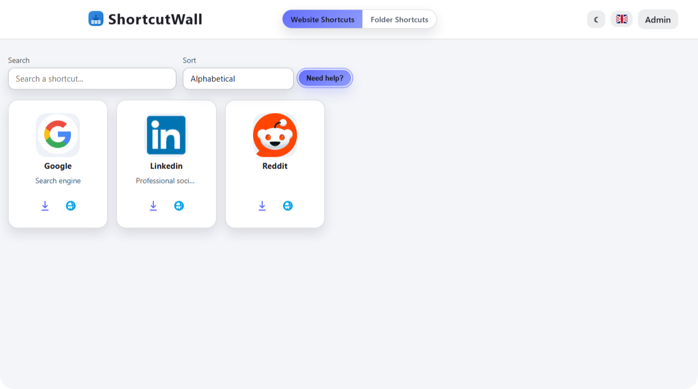

# ShortcutWall
Une application web Node.js pour centraliser les raccourcis vers des sites web et des dossiers partagés, avec une page d'administration pour gérer les raccourcis.

## Vue d'ensemble
ShortcutWall permet aux utilisateurs d'accéder à leurs sites web et dossiers réseau préférés à partir d'une interface unique. L'application comprend une zone d'administration pour ajouter, modifier et supprimer des raccourcis, ainsi que pour télécharger des logos personnalisés et générer automatiquement des fichiers `.url`.

## Fonctionnalités
* 🔥 Mur de raccourcis pour les sites web et les dossiers réseau avec capacités de recherche.
* 🚀 Couche d'authentification simple pour l'administration.
* 🛠️ Gestion des logos via des URL distantes ou des téléchargements locaux.
* 📦 Exportation automatique de fichiers `.url` pour les raccourcis de sites web.
* 🌐 Internationalisation intégrée (français et anglais).

## Stack technique
| Catégorie | Technologies |
|----------|-------------|
| Backend  | Node.js, Express |
| Base de données | Fichiers JSON (data/shortcuts.json, data/folders.json) |
| Template | Moteur de vue EJS |
| Utilitaires | Multer pour les téléchargements de fichiers, Dotenv pour les variables d'environnement |
| Conteneurisation | Docker, Docker Compose |

## Installation et configuration
### Prérequis
* Node.js 18 ou version supérieure.
* npm (inclus avec Node.js).
* Docker et Docker Compose (facultatif, mais recommandé).

### Instructions étape par étape
1.  Clonez le dépôt et naviguez vers le répertoire du projet.
    ```bash
    git clone https://github.com/MrDDream/ShortcutWall.git
    cd ShortcutWall
    ```
2.  Copiez l'exemple de fichier d'environnement et ajustez les valeurs.
    ```bash
    cp .env.example .env
    ```
    Éditez le fichier `.env` pour configurer l'application :
    *   `PORT` : Le port sur lequel l'application écoutera (par défaut : 3050).
    *   `HOST` : L'hôte auquel l'application sera liée (par défaut : 0.0.0.0).
    *   `SESSION_SECRET` : Une chaîne aléatoire pour sécuriser les sessions (obligatoire).
    *   `ADMIN_USER` : Nom d'utilisateur pour la zone d'administration (par défaut : admin).
    *   `ADMIN_PASS` : Mot de passe pour la zone d'administration (par défaut : admin123).
    *   `APP_NAME` : Marque personnalisée pour l'application.
    *   `APP_DEFAULT_LOCALE` : Langue par défaut pour l'application (par défaut : en ou fr).
    *   `SUPPORT_EMAIL` : Adresse e-mail de support.
    *   `SUPPORT_PHONE` : Numéro de téléphone de support.
3.  Exécutez l'application en utilisant Docker Compose. C'est la méthode recommandée.
    ```bash
    docker-compose up
    ```
    Cette commande construit l'image Docker et démarre l'application dans un conteneur. L'application sera accessible à `http://localhost:3050` (ou au `PORT` configuré).
    
    *Alternativement, installez les dépendances et exécutez l'application en mode développement sans Docker :*
    ```bash
    npm install
    npm run dev
    ```

## Utilisation
*   La vue publique affiche les raccourcis stockés dans `data/shortcuts.json` et `data/folders.json`.
*   La zone d'administration est accessible à `/admin` et nécessite les identifiants configurés dans le fichier `.env`.
*   Les images téléchargées sont enregistrées dans `public/uploads` ; retirez-les manuellement si nécessaire.

## Structure du projet
.
├── .dockerignore
├── .env.example
├── data
│ ├── folders.json
│ └── shortcuts.json
├── docker-compose-dev.yml
├── docker-compose.yml
├── Dockerfile
├── LICENSE
├── package.json
├── public
│ └── scripts.js
├── README.md
├── server.js
├── views
│ ├── 404.ejs
│ ├── admin.ejs
│ ├── index.ejs
│ ├── login.ejs
│ └── partials
│ ├── footer.ejs
│ └── head.ejs

## Captures d'écran
|  |  |
|-------------------------------|-------------------------------|

## Contribuer
Les contributeurs sont invités à soumettre des demandes de tirage et des problèmes. Veuillez vous assurer que votre code est bien documenté et respecte le style de codage existant.

## Licence
[MIT](https://github.com/MrDDream/ShortcutWall?tab=MIT-1-ov-file)

## Contact

* [MrDDream](https://github.com/MrDDream)

  

