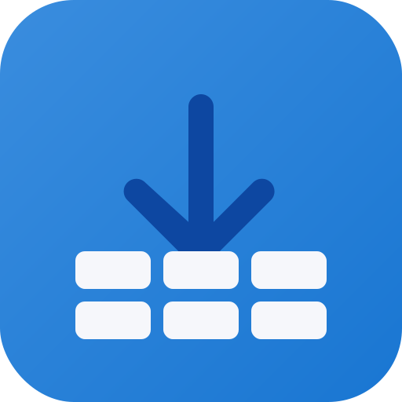
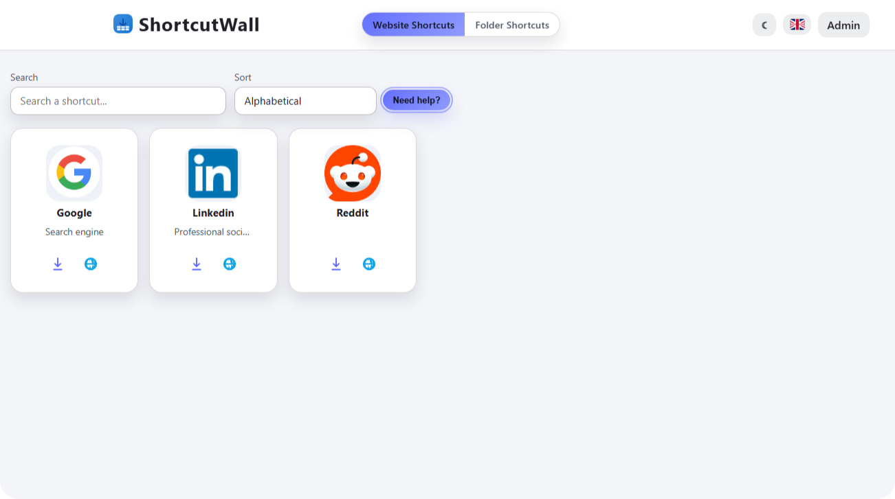
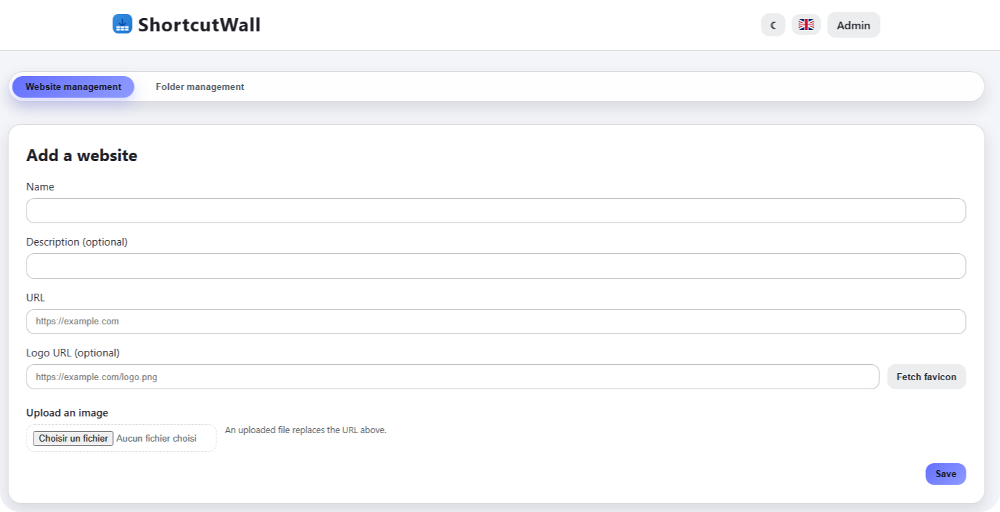

#  ShortcutWall 
This documentation is available in [French](README.fr.md) and in [English](README.md)

## Overview
ShortcutWall allows users to access their favorite websites and network folders from a single interface. The application includes an admin area for adding, modifying, and deleting shortcuts, as well as uploading custom logos and generating `.url` files automatically.

## Features
* 🔥 Shortcut wall for both websites and network folders with search capabilities
* 🚀 Simple admin authentication layer
* 🛠️ Logo management via remote URLs or local uploads
* 📦 Automatic `.url` file export for website shortcuts
* 🌐 Built-in internationalization (French and English)
* 🌗 Dark mode available.

## Screenshots
 

|  |  |
|-------------------------------|-------------------------------|

## Installation & Setup

### Prerequisites
* Node.js 18 or newer
* npm (bundled with Node.js)
* Docker and Docker Compose (optional, but recommended)

### Step-by-Step Instructions

1.  Clone the repository and navigate to the project directory.

    ```bash
    git clone https://github.com/MrDDream/ShortcutWall.git
    cd ShortcutWall
    ```

2.  Copy the environment example and adjust the values.

    ```bash
    cp .env.example .env
    ```

    Edit the `.env` file to configure the application:

    *   `PORT`: The port the application will listen on (default: 3050).
    *   `HOST`: The host the application will bind to (default: 0.0.0.0).
    *   `SESSION_SECRET`: A random string for securing sessions (required).
    *   `ADMIN_USER`: Username for the admin area (default: admin).
    *   `ADMIN_PASS`: Password for the admin area (default: admin123).
    *   `APP_NAME`: Custom branding for the application.
    *   `APP_DEFAULT_LOCALE`: Default language for the application (default: en or fr).
    *   `SUPPORT_EMAIL`: Support email address.
    *   `SUPPORT_PHONE`: Support phone number.

3.  Run the application using Docker Compose. This is the recommended method.

    ```bash
    docker-compose up
    ```

    This command builds the Docker image and starts the application in a container.  The application will be accessible at `http://localhost:3050` (or the configured `PORT`).

    *Alternatively, install dependencies and run the application in development mode without Docker:*

    ```bash
    npm install
    npm run dev
    ```

## Usage

*   The public view displays shortcuts stored in `data/shortcuts.json` and `data/folders.json`.
*   The admin area is accessible at `/admin` and requires the credentials configured in `.env`.
*   Uploaded images are saved to `public/uploads`; remove them manually if needed.

## Tech Stack
| Category | Technologies |
|----------|-------------|
| Backend  | Node.js, Express |
| Database | JSON files (data/shortcuts.json, data/folders.json) |
| Template | EJS view engine |
| Utilities | Multer for file uploads, Dotenv for environment variables |
| Containerization | Docker, Docker Compose |

## Project Structure
```
.
├── .dockerignore
├── .env.example
├── data
│   ├── folders.json
│   └── shortcuts.json
├── docker-compose-dev.yml
├── docker-compose.yml
├── Dockerfile
├── LICENSE
├── package.json
├── public
│   └── scripts.js
├── README.md
├── server.js
├── views
│   ├── 404.ejs
│   ├── admin.ejs
│   ├── index.ejs
│   ├── login.ejs
│   └── partials
│       ├── footer.ejs
│       └── head.ejs

```
## Contributing

Contributors are welcome to submit pull requests and issues. Please ensure that your code is well-documented and follows the existing coding style.

## License

[MIT](https://github.com/MrDDream/ShortcutWall?tab=MIT-1-ov-file)

## Contact

* [MrDDream](https://github.com/MrDDream)

  
